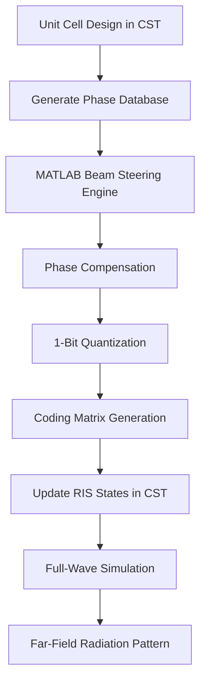

# 26 GHz Reconfigurable Intelligent Surface (RIS) Top-Layer Simulation & Analysis

[](https://www.mathworks.com/products/matlab.html)
[](https://www.3ds.com/products-services/simulia/products/cst-studio-suite/)
[](https://www.3gpp.org/)
[](LICENSE)

An automated research-oriented repository for the design, analysis, and full-wave simulation of a **26 GHz Reconfigurable Intelligent Surface (RIS)** operating in the **5G FR2 n258 mmWave band**.

This project combines:

* **CST Studio Suite** for electromagnetic simulation and RIS geometry synthesis
* **MATLAB** for beam steering computation, phase coding, and database-driven interpolation
* **PIN diode equivalent circuit modeling** for dynamic 1-bit reflective phase control

The system implements a **32 × 32 reflective RIS array (1024 elements)** capable of digitally steering reflected electromagnetic waves using programmable ON/OFF phase states.

---

# 📖 Project Overview

At millimeter-wave frequencies, wireless communication systems suffer from:

* High free-space path loss
* Severe signal blockage
* Limited diffraction capability

A **Reconfigurable Intelligent Surface (RIS)** improves propagation conditions by dynamically controlling the reflected electromagnetic wavefront.

This project focuses on the **Top-Layer Reflective RIS Design**, including:

* Unit cell modeling
* PIN diode equivalent circuits
* Automated CST array generation
* MATLAB-based phase synthesis
* Beam steering analysis
* Full-wave far-field simulation

---

# 📊 System Specifications

| Parameter             | Value                   |
| --------------------- | ----------------------- |
| Operating Frequency   | 26 GHz                  |
| Frequency Band        | 5G FR2 n258             |
| Array Size            | 32 × 32                 |
| Total Elements        | 1024                    |
| Unit Cell Pitch       | 5.5 mm                  |
| Phase Resolution      | 1-Bit                   |
| Phase States          | 0° / 180°               |
| Substrate Material    | Rogers RT6010           |
| Relative Permittivity | 10.7                    |
| Loss Tangent          | 0.0023                  |
| Substrate Thickness   | 0.254 mm                |
| Active Device         | MACOM MLP7140 PIN Diode |

---

# 📂 Repository Structure

```bash
CST_I_shape_26GHz/
├── README.md
├── datasheets/
│   └── MACOM_MLP71xx_Series_Limiter_Diodes.pdf
├── data/
│   └── unitcell_phases/
│       ├── matrix_0_OFF.txt
│       ├── matrix_0_ON.txt
│       ├── matrix_15_OFF.txt
│       ├── matrix_15_ON.txt
│       ├── matrix_30_OFF.txt
│       ├── matrix_30_ON.txt
│       ├── matrix_45_OFF.txt
│       ├── matrix_45_ON.txt
│       ├── matrix_60_OFF.txt
│       └── matrix_60_ON.txt
├── reports/
│   └── RIS_26GHz_TopLayer_Design_and_Simulation_Report.pdf
├── scripts/
│   ├── build_32x32_unbiased_ris_array.bas
│   ├── generate_beam_steering_pattern.m
│   └── update_32x32_ris_pattern.bas
└── i_shape_unitcell_26ghz_mlp7140/
    ├── I_shape_unitcell_MLP7140-11.cst
    ├── README.md
    └── Model/
```

---

# ⚙️ Workflow Overview

The project workflow consists of three major stages:



---

# 🧠 MATLAB Beam Steering Engine

The MATLAB script:

```matlab
generate_beam_steering_pattern.m
```

performs:

* Phase compensation
* Beam steering synthesis
* Digital phase quantization
* Complex vector interpolation
* Radiation pattern prediction

The system supports arbitrary incident angles by interpolating missing phase information from pre-simulated lookup tables.

---

# ⚡ PIN Diode Equivalent Circuit Model

The RIS uses the **MACOM MLP7140 PIN diode** modeled as an equivalent RLC lumped element.

## ON State

When forward biased:

```math
Z_{\text{ON}} = R_s + j\omega L_v
```

## OFF State

When reverse biased:

```math
Z_{\text{OFF}} = j\omega L_v + \frac{1}{j\omega C_t}
```

Where:

* $R_s$ = series resistance
* $L_v$ = parasitic inductance
* $C_t$ = junction capacitance

---

# 📡 Beam Steering Principle

The RIS manipulates the reflected wavefront by compensating for spatial phase delay across the surface.

The required reflection phase is computed from:

```math
\Phi_{\text{RIS}} = \Phi_{\text{scatter}} - \Phi_{\text{incident}}
```

Each element is then assigned to either:

* ON State → approximately 180°
* OFF State → approximately 0°

using nearest-state phase quantization.

---

# 🚀 How to Run the Project

## Step 1 — Generate Coding Matrix in MATLAB

Open:

```matlab
scripts/generate_beam_steering_pattern.m
```

Set desired angles:

```matlab
theta_i_deg = 55;
theta_s_deg = 60;
```

Run the script.

Generated outputs:

* `Coding_Matrix_32x32.txt`
* Radiation pattern plots
* Predicted RCS data

---

## Step 2 — Build RIS Array in CST

Open CST Studio Suite.

Import macro:

```vb
build_32x32_unbiased_ris_array.bas
```

The macro automatically:

* Replicates the 32×32 geometry
* Creates 1024 lumped elements
* Maps switch states to parameters

---

## Step 3 — Apply RIS Coding Matrix

Open:

```vb
update_32x32_ris_pattern.bas
```

Update:

```vb
row_pattern = "10011001100011001100110011001100"
```

Run the macro.

Then execute:

* Frequency Domain Solver
  or
* Time Domain Solver

to extract far-field radiation patterns.

---

# 🔥 Power Consumption Analysis

Each PIN diode requires:

* Forward voltage ≈ 0.734 V
* Forward current ≈ 10 mA

Worst-case condition:

```text
1024 active elements
```

Total current:

```math
I_{\text{total}} = 1024 \times 10\text{ mA} = 10.24\text{ A}
```

Total power:

```math
P_{\text{total}} = 10.24\text{ A} \times 0.734\text{ V} = 7.52\text{ W}
```

---

# 🧪 Software Requirements

## MATLAB

* MATLAB R2023a or later
* Signal Processing Toolbox

## CST Studio Suite

* CST Studio Suite 2021 or later
* VBA Macro Support Enabled

---

# 📜 License

This project is licensed under the MIT License.

---

# 📚 Citation

If you use this project in academic research, please cite:

```bibtex
@techreport{RIS26GHzTopLayer2026,
  author      = {Palita Kaewsena},
  title       = {26 GHz Reconfigurable Intelligent Surface (RIS) Top-Layer Simulation & Analysis},
  institution = {Faculty of Engineering},
  year        = {2026}
}
```

---

# 👨🔬 Research Focus

This repository is intended for:

* Reconfigurable Intelligent Surface (RIS) research
* 5G/6G mmWave communication studies
* Reflectarray and metasurface engineering
* Electromagnetic beam steering
* CST-MATLAB co-simulation workflows

---
