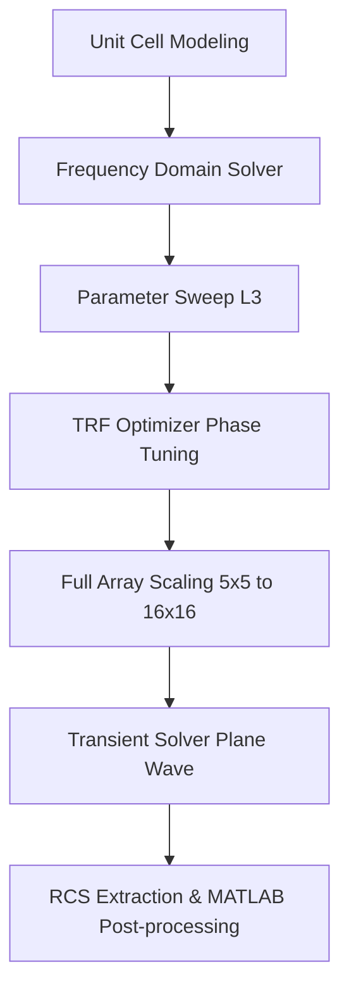

# CST Studio Suite Reflective Metasurface Simulation Study

This repository contains the design, modeling, optimization, and characterization files for a high-frequency reflective metasurface simulation study performed in CST Studio Suite. The research investigates the electromagnetic response of a tunable reflective unit cell and scales the design to a $16 \times 16$ element array. Key performance metrics analyzed include reflection coefficient ($S_{11}$, $S_{21}$), phase response, TE/TM polarization behavior, and bistatic Radar Cross Section (RCS) reduction.

---

## 2. Repository Structure

Users must preserve the directory hierarchy exactly as shown below when uploading or maintaining this project. Do not rename folders, reorganize files, or separate the CST model components from their parent structures.

```text
cst-metasurface-study
├── README.md
├── CST_model
│   ├── unit_cell_base.cst
│   └── full_array_base.cst
├── reports
│   ├── report_task1_unit_cell_sweep.pdf
│   ├── report_task2_unit_cell_optimization.pdf
│   ├── report_task3_runtime_analysis.pdf
│   ├── report_task4_runtime_mesh_accuracy.pdf
│   └── report_task5_full_array_16x16.pdf
└── Ref
```

> [!IMPORTANT]
> **Repository Integrity Guidelines:**
> * **Upload the complete folder structure** exactly as defined above to the GitHub repository.
> * **Do not rename folders** (`CST_model`, `reports`, `Ref`).
> * **Do not move CST files** out of the `CST_model` folder, as internal project links and mesh files depend on this relative path.
> * **Keep reports inside `/reports`** to maintain chronological trace of tasks.
> * **Keep CST projects inside `/CST_model`** to preserve cache configurations.
> * **Preserve directory hierarchy** to allow automatic scripting and comparative analysis.

---

## 3. Prerequisites

To execute the simulations, process the output data, and reproduce the results, the following tools and competencies are required:

### Software Requirements
* **CST Studio Suite** (2021 or newer recommended; utilizing GPU computing tokens for full-array simulations).
* **MATLAB** (R2021a or newer for ASCII post-processing, automated exporting, and RCS scaling visualizations).

### Theoretical Knowledge
* **Electromagnetic Field Theory:** Plane wave propagation, reflection, refraction, and phase shifting.
* **RF & Antenna Engineering:** S-parameter definitions ($S_{11}$, $S_{21}$), Floquet port modes, and periodic boundaries.
* **Metasurfaces:** Anisotropic impedance surfaces, phase-gradient reflectarrays, and polarization conversion.

---

## 4. Step-by-Step Simulation Guide

The workflow progresses from a single unit cell design to a full finite array simulation. This guide outlines the key solvers, boundary configurations, and post-processing tools:



### 1. Solver Selection
* **Frequency Domain Solver (F-Solver):** Ideal for periodic structures, infinite unit cell arrays, and highly resonant designs. Employs a Tetrahedral mesh.
* **Transient Solver (T-Solver):** Ideal for electrically large structures, finite arrays, and complex shapes. Employs a Hexahedral mesh and calculates wideband results in a single run.

### 2. Excitation Configuration
* **Periodic Unit Cell:** Excited using Floquet Ports ($Z_{max}$ and $Z_{min}$), calculating reflection and transmission coefficients for TE and TM modes.
* **Full Array:** Excited using a Plane Wave source (source direction along $-Z$) to simulate uniform illumination in the far field.

### 3. Boundary Conditions
* **Unit Cell:** Boundary conditions set to `Unit Cell` in $X$ and $Y$ directions to simulate an infinite periodic array.
* **Full Array:** Boundary conditions set to `Open (add space)` or PML (Perfectly Matched Layer) in all directions to simulate free-space conditions.

### 4. Polarization Setup
* **TE Polarization:** Transverse Electric mode where the electric field vector lies perpendicular to the plane of incidence.
* **TM Polarization:** Transverse Magnetic mode where the magnetic field vector lies perpendicular to the plane of incidence.

### 5. Parameter Extraction
* **S11 and S21:** Tracked in the 1D Results tree to assess reflection magnitude, transmission loss, and phase response.
* **RCS (Radar Cross Section):** Bistatic and monostatic RCS parameters are extracted using far-field monitors at specific resonant frequencies.

---

## 5. Part 1 — Unit Cell Analysis

The infinite unit cell approximation is analyzed using [unit_cell_base.cst](file:///c:/Users/palit/Desktop/metasurface-array-cst-study/CST_model/unit_cell_base.cst). This model represents the core building block of the metasurface. The unit cell consists of a metallic patch on a dielectric substrate backed by a ground plane, creating an patch-cavity resonator.

---

## 6. Task 1 — Parameter Sweep

A parameter sweep is performed to evaluate the sensitivity of the resonant frequency and phase profile to physical dimensions.

### Procedure:
1. Open the unit cell project [unit_cell_base.cst](file:///c:/Users/palit/Desktop/metasurface-array-cst-study/CST_model/unit_cell_base.cst).
2. Go to the ribbon and select **Home > Parameter Sweep**.
3. Create a new sequence and add parameter `L3`.
4. Configure the sweep according to the desired mode:
   * **Step Width:** Evaluates the parameter from a start value to an end value at set physical increments (e.g., step size of $0.05\text{ mm}$).
   * **Number of Samples:** Evaluates the parameter at a set number of equidistant linearly spaced points.
5. Click **Start** to run the parameter sweep.
6. Once the simulation completes, expand the **1D Results > S-Parameters** tree to inspect the phase and magnitude responses.
7. Compare the swept curves with the reference data in [report_task1_unit_cell_sweep.pdf](file:///c:/Users/palit/Desktop/metasurface-array-cst-study/reports/report_task1_unit_cell_sweep.pdf).

---

## 7. Task 2 — Optimizer

Automated tuning is conducted to target precise reflection phases at specified frequency bands using the built-in optimizer.

### Optimization Setup:
* **Algorithm:** Trust Region Framework (TRF). TRF is a robust local optimization algorithm that builds linear/quadratic models of the parameter space, ensuring rapid and stable convergence.
* **Objective Function:** Minimize the deviation of the reflection phase from the targeted design curve (e.g., $180^\circ$ phase shift at $24\text{ GHz}$).
* **Variables:** Geometric bounds defined in [report_task2_unit_cell_optimization.pdf](file:///c:/Users/palit/Desktop/metasurface-array-cst-study/reports/report_task2_unit_cell_optimization.pdf).
* **Execution:** Select the **Trust Region Framework** solver in the CST Optimizer window, load the goals, and press **Start**.

---

## 8. Part 2 — Runtime & Mesh Knowledge Base

Understanding the numerical mesh and its effect on runtime is critical for managing computational assets.

Detailed benchmarks are available in [report_task3_runtime_analysis.pdf](file:///c:/Users/palit/Desktop/metasurface-array-cst-study/reports/report_task3_runtime_analysis.pdf) and [report_task4_runtime_mesh_accuracy.pdf](file:///c:/Users/palit/Desktop/metasurface-array-cst-study/reports/report_task4_runtime_mesh_accuracy.pdf).

### Mesh Cells and Accuracy
* **Hexahedral vs. Tetrahedral Meshing:** Hexahedral meshes are structured and used by the Transient Solver, while Tetrahedral meshes are unstructured and conform to curved geometries in the Frequency Domain Solver.
* **Runtime vs. Accuracy Tradeoff:**
  | Mesh Density | Average Runtime | S-Parameter Accuracy | Best Application |
  | :--- | :--- | :--- | :--- |
  | **Coarse (10 cells/wavelength)** | Minimal | Low ($\pm 1.5\text{ GHz}$ shift) | Rapid structural screening |
  | **Normal (15 cells/wavelength)** | Moderate | High ($\pm 0.2\text{ GHz}$ shift) | Optimization iterations |
  | **Fine (25 cells/wavelength)** | High | Excellent ($< 0.05\text{ GHz}$ shift) | Final design verification |

* **Solver Tradeoff:** F-Solver scales well for small, periodic domains but experiences high memory usage ($O(N^3)$) as the structure expands. T-Solver scales with $O(N)$ memory consumption, making it the preferred choice for finite full-array analyses.

---

## 9. Part 3 — Full Array Simulation

Transitioning from an infinite model to a real-world device requires simulating a finite array using [full_array_base.cst](file:///c:/Users/palit/Desktop/metasurface-array-cst-study/CST_model/full_array_base.cst).

### Setup and Settings:
* **Solver:** Transient Solver (T-Solver).
* **Excitation:** Plane Wave source representing a far-field transmitter.
* **Monitor:** Farfield monitors at $24\text{ GHz}$, $30\text{ GHz}$, and $38\text{ GHz}$.
* **Evaluation:** Observe S-parameters and Farfield radiation patterns, comparing them to [report_task5_full_array_16x16.pdf](file:///c:/Users/palit/Desktop/metasurface-array-cst-study/reports/report_task5_full_array_16x16.pdf).

---

## 10. Methodological Pivot Warning

> [!WARNING]
> **Optimization Instability in Electrically Large Metasurfaces**
> 
> Standard black-box optimization algorithms, such as the Trust Region Framework (TRF) or Particle Swarm Optimization (PSO), become unstable and fail to converge when applied directly to full-array configurations. 
> 
> **Why Black-Box Optimizers Fail on Large Arrays:**
> 1. **High Dimensionality and Non-Convexity:** The parameter landscape of a $16 \times 16$ metasurface exhibits numerous local minima, causing global search methods to stall.
> 2. **Resonance Distortion:** Inter-element coupling shifts the local resonance of individual unit cells, distorting the objective function.
> 3. **Computational Cost:** A single full-wave simulation of a $16 \times 16$ array can take several hours. Running hundreds of solver iterations in a black-box optimization loop is computationally prohibitive.
> 
> **Solution:** To ensure convergence and physical viability, this study pivots to a **Sequential Parameter Sweep** and **Multi-Parameter Sweep** methodology, systematically mapping the resonance peaks.

---

## 11. Sequential Parameter Sweep Procedure

The sequential sweep procedure determines the optimal dimensions for resonant tuning by adjusting one parameter at a time while keeping others fixed.

### Step 1: Tune $L_2$ for low-band resonance
* **Fixed Parameters:** $L_3 = 0.95\text{ mm}$, $R = 1.15\text{ mm}$
* **Sweep Range:** $L_2 = 2.7\text{ mm} \rightarrow 3.0\text{ mm}$ (Step size: $0.05\text{ mm}$)
* **Optimal Value:** $L_2 = 2.9\text{ mm}$
* **Resonant target:** $24\text{ GHz}$

### Step 2: Tune $L_3$ for mid-band performance
* **Fixed Parameters:** $L_2 = 2.9\text{ mm}$, $R = 1.15\text{ mm}$
* **Sweep Range:** $L_3 = 0.8\text{ mm} \rightarrow 1.1\text{ mm}$ (Step size: $0.05\text{ mm}$)
* **Optimal Value:** $L_3 = 1.1\text{ mm}$

### Step 3: Tune $R$ for high-band resonance
* **Fixed Parameters:** $L_2 = 2.9\text{ mm}$, $L_3 = 1.1\text{ mm}$
* **Sweep Range:** $R = 1.1\text{ mm} \rightarrow 1.2\text{ mm}$ (Step size: $0.05\text{ mm}$)
* **Optimal Value:** $R = 1.1\text{ mm}$
* **Resonant target:** $38\text{ GHz}$

---

## 12. Multi-Parameter Sweep & Global Scale

To account for simultaneous dimensional variations and mutual coupling, a global parameter `scale` is introduced.

```text
L2 = 2.9 mm + scale
```

### Optimization and Sweep Sequence:
1. **Sweep `scale`:** From $0\text{ mm} \rightarrow 0.1\text{ mm}$ to observe bulk shift.
   * *Best stable value:* `scale` = $0.1\text{ mm}$
2. **Sweep $R$:** From $1.1\text{ mm} \rightarrow 1.25\text{ mm}$ using the updated `scale`.
   * *Final optimal value:* $R = 1.15\text{ mm}$
3. **Fine-Tuning:** Sweep `scale` from $-0.1\text{ mm} \rightarrow 0.1\text{ mm}$ around the new baseline.

---

## 13. Golden Parameters Equation

Based on the multi-parameter sweeps, the finalized stable geometries that achieve multi-band resonance are defined by the following golden parameter set:

$$L_2 = 2.95\text{ mm}, \quad L_3 = 1.1\text{ mm}, \quad R = 1.15\text{ mm}$$

---

## 14. Array Scaling and MATLAB Export Checklist

### Array Expansion
Use the **Translate Structure** tool in CST to duplicate the finalized unit cell design into larger arrays:
$$\text{Unit Cell} \rightarrow 5 \times 5 \text{ Array} \rightarrow 10 \times 10 \text{ Array} \rightarrow 16 \times 16 \text{ Array}$$

Run full-wave simulations for each configuration to monitor phase coherence and sidelobe behavior.

### Data Export Requirements
Export the following parameters from CST at $24\text{ GHz}$, $30\text{ GHz}$, and $38\text{ GHz}$:
* **S-parameters ($S_{11}$, $S_{21}$)**
* **TE and TM polarization data**
* **Bistatic RCS Abs**

### Export File Formats:
* Plain text ASCII (`.txt`)
* Comma-Separated Values (`.csv`)
* **Note:** Export both **$\text{dB}(\text{m}^2)$** and **linear $(\text{m}^2)$** scale datasets.

### MATLAB Post-Processing Checklist:
- [ ] Parse ASCII CST output files.
- [ ] Plot reflection amplitude and phase profiles across the frequency band.
- [ ] Compare TE/TM polarization cross-coupling magnitudes.
- [ ] Reconstruct 3D Far-field/Bistatic RCS plots.
- [ ] Evaluate runtime scaling behavior vs. array element count.
- [ ] Quantify the effect of mesh density on spatial resolution and compute time.
- [ ] Calculate the absolute computational cost (RAM footprint, solver duration).

---

## 15. Notes for Beginners

If you are new to CST Studio Suite and metasurface modeling, keep these operational tips in mind:

* **CST Runtime Factors:** Solver times depend heavily on the minimum mesh step, excitation signals, and the complexity of the geometry. Keep substrates thin relative to wavelength to prevent small mesh cells.
* **Mesh Density Control:** A mesh that is too coarse will miss resonance shifts, while a mesh that is too dense will consume excess resources. Aim for a mesh density of at least $\lambda/10$ inside dielectric materials.
* **Solver Selection Rule of Thumb:** Use the **Frequency Domain Solver** for single unit cells with periodic boundaries. Switch to the **Transient Solver** when simulating the full array structure.
* **Memory Usage Management:** Full-wave simulations of $16 \times 16$ arrays can exceed $32\text{ GB}$ of RAM. Utilize symmetry planes (magnetic and electric walls) if the excitation and structure are symmetrical to reduce computation size by $2\times$ or $4\times$.
* **Parameter Sweeps:** Set up all dimensions as variables from the start. Parametric modeling allows you to run sweeps and optimization routines without manually reconstructing the geometry.
* **Why Full-Array Simulation is Expensive:** In a unit cell, periodic boundary conditions simulate an infinite array using a single mesh block. A full-array simulation requires modeling every element, boundary gap, and PML layer, leading to millions of mesh cells.

---

## 16. Citation / Research Note

If you find this work, the CST base models, or the sweep procedures useful for your research, please cite this study:

```bibtex
@misc{cst_metasurface_study2026,
  author       = {Reflective Metasurface Research Lab},
  title        = {CST Studio Suite Reflective Metasurface Simulation Study: Unit Cell Optimization to Full Array Synthesis},
  year         = {2026},
  publisher    = {GitHub},
  journal      = {GitHub Repository},
  howpublished = {\url{https://github.com/palitakaewsena-sudo/Summer2026_Intern.git}}
}
```

---

## 17. Author Section

## 📝 Author

[Insert your name or research group here]
