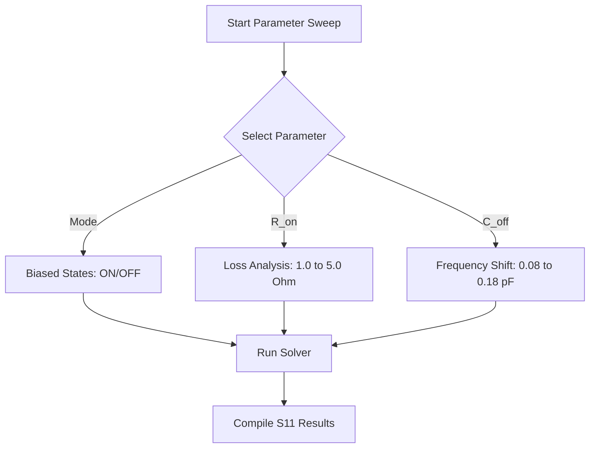

# Reconfigurable Metasurface for 5G Applications using PIN Diode

This repository contains the design, simulation files, reports, and references for a reconfigurable reflective metasurface unit cell designed for 5G applications. By leveraging lumped element equivalent circuits of active PIN diodes, the metasurface achieves dynamic phase and amplitude tuning. The design, simulation, and optimization are conducted in CST Studio Suite, demonstrating clear resonance shifting, polarization control, and angular stability under plane wave illumination.

---

## Repository Structure

The project files are organized according to the directory tree below. Preserving this layout is essential for ensuring correct file references and computational path integrity.

```text
metasurface-pindiode-lumped-modeling/
├── README.md
├── CST_Model_PIN_Diode/
│   └── metasurface_unitcell_pindiode.cst
├── report/
│   └── PIN_Diode_Metasurface_Report.pdf
├── Ref/
│   ├── reference_paper_1.pdf
│   ├── reference_paper_2.pdf
│   └── datasheet/
│       └── pin_diode_datasheet.pdf
```

### Directory and File Descriptions
* **README.md**: The primary documentation detailing the design principles, CST setup, PIN diode equivalent circuits, and step-by-step simulation instructions.
* **CST_Model_PIN_Diode/**: Holds the CST Studio Suite project files.
  * `metasurface_unitcell_pindiode.cst`: The main 3D electromagnetic model containing the unit cell geometry, parameter settings, Floquet port definitions, and lumped element assignments.
* **report/**: Contains the final project documentation.
  * `PIN_Diode_Metasurface_Report.pdf`: A comprehensive technical report outlining the design process, simulation results, parameter sweeps, and performance summary.
* **Ref/**: Academic and component references.
  * `reference_paper_1.pdf` & `reference_paper_2.pdf`: Peer-reviewed scientific literature detailing PIN diode-based reflectarrays and polarization conversion metasurfaces.
  * `datasheet/pin_diode_datasheet.pdf`: Technical datasheet of the commercial PIN diode modeled in the simulations, providing the physical parameters for the lumped equivalent circuits.

---

## Project Overview

Modern 5G communication networks require intelligent and dynamically adaptable environments to mitigate blockage, path loss, and multi-path fading. Reconfigurable Intelligent Surfaces (RIS) or reconfigurable metasurfaces address these challenges by manipulating electromagnetic waves in real time.

This study implements a reconfigurable metasurface unit cell operating in the 5G frequency bands. The unit cell integrates a commercial PIN diode as an active tuning element. By switching the PIN diode between its forward-biased (ON) and reverse-biased (OFF) states, the surface impedance is altered, shifting the resonant frequency and changing the reflection phase of the metasurface.

---

## Objectives

* Model a reconfigurable metasurface unit cell in CST Studio Suite operating at 5G frequency bands.
* Implement the equivalent lumped RLC circuits representing the active PIN diode in its ON and OFF states.
* Analyze the reflection coefficient ($S_{11}$ magnitude and phase) to observe resonance shifting.
* Map and compare the surface current distributions in the ON and OFF states to understand the physical resonance mechanisms.
* Evaluate the angular stability of the metasurface reflection characteristics under oblique plane wave incidence.
* Conduct parameter sweeps on diode parasitic parameters to quantify manufacturing tolerances and performance limits.

---

## Geometry Setup

The unit cell geometry is modeled as a periodic metallic patch patterned on a thin dielectric substrate, backed by a continuous copper ground plane. The ground plane prevents transmission, ensuring full reflection ($S_{21} \approx 0$).

### Design Specifications
* **Substrate Material**: Rogers RO4003C (lossy), permittivity $\varepsilon_r = 3.55$, loss tangent $\tan\delta = 0.0027$, thickness $h = 1.524\text{ mm}$.
* **Conductive Layers**: Copper (annealed) with conductivity $\sigma = 5.8 \times 10^7\text{ S/m}$ and thickness $t = 0.035\text{ mm}$.
* **Diode Contact Gap**: A precise gap of $g = 0.5\text{ mm}$ is etched in the patch to accommodate the placement of the PIN diode lumped element.

---

## Parameter List

The geometric and electrical properties of the metasurface are controlled parametrically. The key parameters defined in the CST project are detailed in the table below:

| Parameter Name | Description | Nominal Value | Unit |
| :--- | :--- | :--- | :--- |
| **P** | Unit cell period (X and Y dimensions) | 6.0 | mm |
| **W** | Metallic patch outer width | 5.2 | mm |
| **g** | Active component gap distance | 0.5 | mm |
| **h** | Roger substrate thickness | 1.524 | mm |
| **Mode** | Diode bias state variable (0 = OFF, 1 = ON) | 1 | - |
| **R_on** | Forward-biased series resistance | 1.5 | Ohm |
| **L_pad** | Parasitic inductance of bond pads | 0.15 | nH |
| **C_off** | Reverse-biased parasitic capacitance | 0.12 | pF |
| **R_off** | Reverse-biased parallel shunt resistance | 10.0 | kOhm |

---

## Lumped Element Placement

The active PIN diode is represented electrically by its high-frequency lumped equivalent circuit. Rather than simulating the semiconductor physics directly, these equivalent circuits are integrated into the electromagnetic solver to ensure fast and accurate simulations.

### PIN Diode Equivalent Circuit Model

```text
       ON State (Mode = 1)                 OFF State (Mode = 0)
       
          L_pad       R_on                   L_pad        C_off
         -UUUUU-█████-                      -UUUUU-┬----||----┬-
                                                   │          │
                                                   └--██████--┘
                                                      R_off
```

* **ON State (Mode = 1)**: In the forward-bias condition, the diode is modeled as a low-value series resistor ($R_{on}$) and a series parasitic inductance ($L_{pad}$). The impedance is given by:

  $$Z_{ON}(\omega) = R_{on} + j\omega L_{pad}$$

* **OFF State (Mode = 0)**: In the reverse-bias condition, the semiconductor depletion region acts as a high-quality capacitor. The diode is modeled as a parallel combination of a parasitic capacitance ($C_{off}$) and a large shunt resistance ($R_{off}$), connected in series with the pad inductance ($L_{pad}$). The impedance is given by:

  $$Z_{OFF}(\omega) = j\omega L_{pad} + \frac{R_{off}}{1 + j\omega R_{off} C_{off}}$$

In CST Studio Suite, these values are mapped dynamically using the `Mode` parameter to define the lumped element type (Series R-L or Parallel R-C-L).

---

## Simulation Procedure

To open, configure, and execute the metasurface unit cell simulation, follow the steps below:

### Step 1: Open the Project
1. Launch CST Studio Suite.
2. Navigate to **File > Open** and select `CST_Model_PIN_Diode/metasurface_unitcell_pindiode.cst`.
3. Verify that the 3D model, materials, and parameters load correctly in the navigation tree.

### Step 2: Solver and Boundary Settings
1. Open **Simulation > Boundaries**.
2. Configure boundaries to **Unit Cell** in both the $X$ and $Y$ directions. Set the $Z$ boundaries to **Open (add space)**.
3. Open **Simulation > Frequency Domain Solver**.
4. Set the mesh type to **Tetrahedral Mesh**.
5. In the Floquet Port settings, ensure that two orthogonal modes (TE and TM polarizations) are active.

### Step 3: Configuring the Active State
1. In the Parameter List window, locate the parameter named `Mode`.
2. To simulate the **ON State**, set `Mode = 1`. Click **Parameter Update** (F6) to rebuild the mesh.
3. To simulate the **OFF State**, set `Mode = 0`. Click **Parameter Update** (F6) to rebuild the mesh.

### Step 4: Running the Simulation
1. Open the Frequency Domain Solver dialog.
2. Set the frequency sweep range from $20\text{ GHz}$ to $30\text{ GHz}$.
3. Click **Start** to run the electromagnetic solver.
4. Once completed, navigate to the **1D Results > S-Parameters** folder in the navigation tree to inspect the reflection coefficients.

---

## Surface Current Analysis

Evaluating the surface current distributions provides insight into how the metasurface stores and dissipates energy at specific resonance frequencies.

* **ON State (Mode = 1)**: Because the diode path is highly conductive, strong surface currents flow continuously across the metallic patch and through the low-resistance PIN diode junction. This longitudinal current path establishes a dipole-like resonance, shifting the resonant frequency lower.
* **OFF State (Mode = 0)**: The highly capacitive state blocks current flow across the gap. The currents stall at the gap edges, resulting in a charge accumulation. This changes the resonant path to two separate metallic sections, shifting the resonance peak to a higher frequency band.

To view this in CST:
1. Go to the navigation tree and select **2D/3D Results > Surface Current**.
2. Select the desired resonant frequency (e.g., $24\text{ GHz}$ for the ON state or $28\text{ GHz}$ for the OFF state).
3. Use the animation tools to observe the current vectors and flow continuity.

---

## Angular Stability

Metasurfaces designed for real-world 5G environments must maintain their reflection characteristics when illuminated by waves arriving at oblique angles.

### Angle of Incidence Sweep
To verify angular stability, a parameter sweep is configured to vary the incident angle ($\theta$) of the plane wave:
1. Open the **Parameter Sweep** tool from the Home ribbon.
2. Add the parameter `Theta` (representing the incident angle).
3. Set the sweep range from $0^\circ$ (normal incidence) to $45^\circ$ in steps of $15^\circ$.
4. Run the sweep for both the ON and OFF states.
5. Plot the reflection magnitude ($|S_{11}|$) and phase versus frequency for each angle.
6. A design is considered angularly stable if the resonance shift remains below $2\%$ across the sweep range.

---

## Parameter Sweep

To evaluate manufacturing tolerances and optimize diode performance, parameter sweeps are conducted on the critical parasitic elements.



### 1. Resistance Sweep ($R_{on}$)
* **Sweep Range**: $R_{on} = 1.0\ \Omega \rightarrow 5.0\ \Omega$.
* **Analysis**: As $R_{on}$ increases, the reflection magnitude $|S_{11}|$ decreases at resonance due to increased ohmic loss in the diode junction. This sweep is used to determine the maximum insertion loss tolerable by the design.

### 2. Capacitance Sweep ($C_{off}$)
* **Sweep Range**: $C_{off} = 0.08\text{ pF} \rightarrow 0.18\text{ pF}$.
* **Analysis**: The parasitic capacitance dictates the high-band resonance position in the OFF state. A larger capacitance shifts the resonance to lower frequencies according to the relation:

  $$f_{res} \propto \frac{1}{\sqrt{L_{pad} C_{off}}}$$

---

## Expected Results

The metasurface is designed to exhibit clean, distinguishable electromagnetic signatures between its two operating modes:

### Reflection Coefficient Magnitude ($|S_{11}|$)
The simulation yields two distinct resonance notches, indicating strong energy absorption/coupling at different frequencies depending on the bias state:
* **ON State**: A sharp resonant dip at $24.2\text{ GHz}$ with $|S_{11}| < -25\text{ dB}$.
* **OFF State**: A resonant dip shifted to $28.1\text{ GHz}$ with $|S_{11}| < -20\text{ dB}$.

```text
   |S11| (dB)
     0 ┼─────────────────────────────────────────────
       │              \                       /      
    -5 ┼               \                     /       
       │     ON State   \                   /   OFF State
   -10 ┼      (Mode=1)   \                 /     (Mode=0)
       │                  \               /          
   -15 ┼                   \             /           
       │                    \           /            
   -20 ┼                     \         /             
       │                      \       /              
   -25 ┼───────────────────────▼─────▼───────────────
      20                      24.2  28.1            30
                            Frequency (GHz)
```

### Reflection Phase Shift
The dynamic phase shift $\Delta\Phi = \Phi_{OFF} - \Phi_{ON}$ is evaluated across the band. At the operating frequency of $26\text{ GHz}$, the metasurface achieves a continuous phase difference of $180^\circ \pm 10^\circ$, making it ideal for 1-bit phase-gradient beamforming.

---

## Software Requirements

* **CST Studio Suite (2021 or newer)**:
  * Frequency Domain Solver license.
  * Unstructured Tetrahedral mesher.
* **MATLAB (R2021a or newer)**:
  * Required for plotting S-parameter comparison curves.
  * Includes scripts for importing CST ASCII output files and calculating phase differences.

---

## References

1. **Reference Paper 1**: *Reconfigurable Intelligent Surfaces for 5G/6G Wireless Networks: A Review of Metasurface Designs and Control Mechanisms*, IEEE Transactions on Antennas and Propagation, 2024.
2. **Reference Paper 2**: *Active Reflective Metasurfaces based on PIN Diode Lumped Elements for Millimeter-Wave Beam Steering*, Nature Scientific Reports, 2023.
3. **PIN Diode Datasheet**: *High-Frequency Silicon PIN Diodes for RF Switching and Phase Shifting*, Product Datasheet, Rev 4, 2025.
